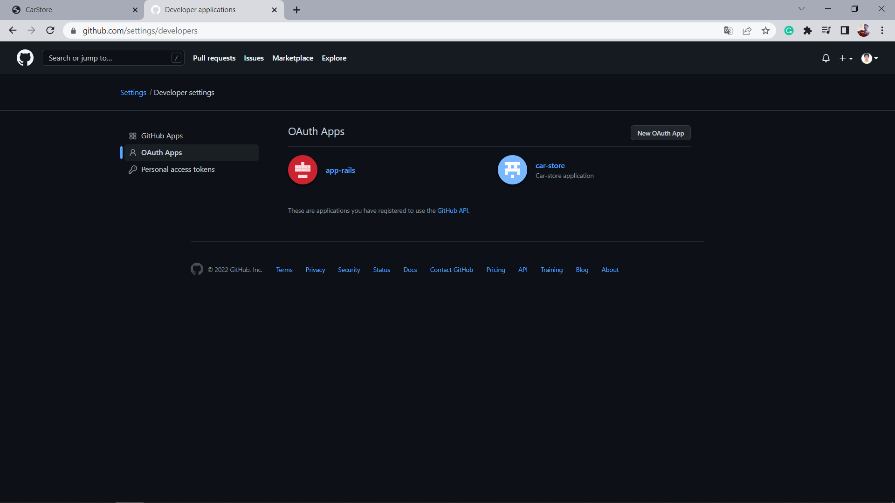
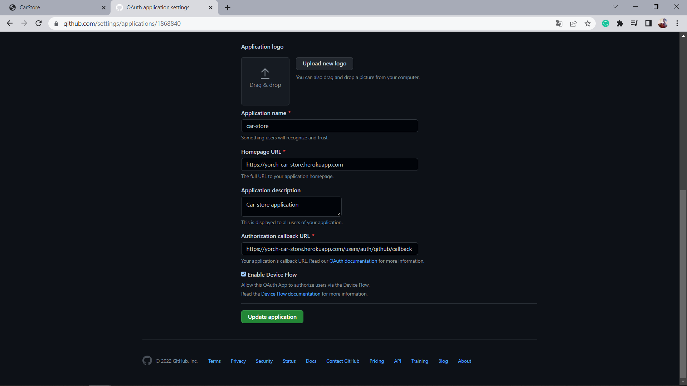
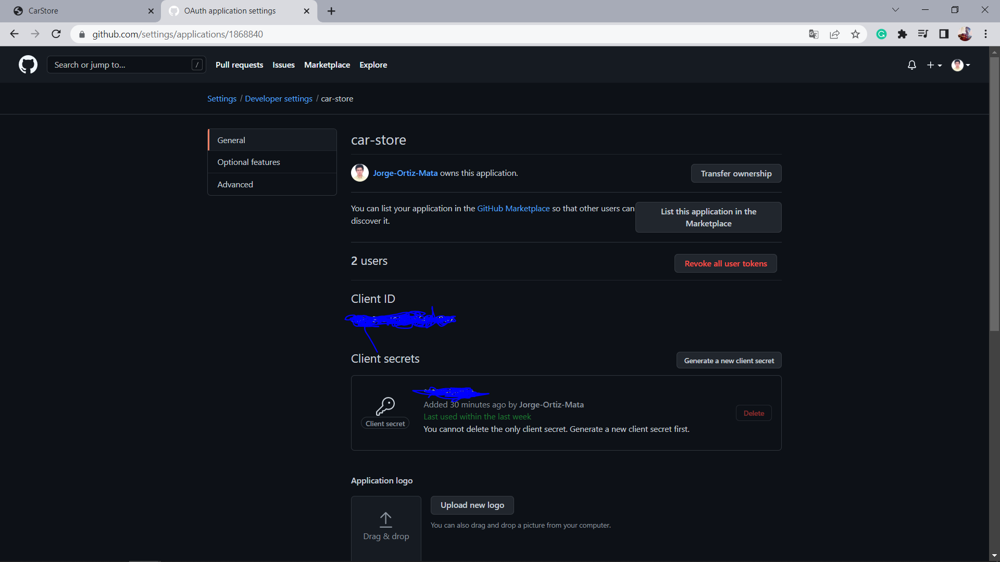

# Sign up Github Omniauth.

In order to allow users sign up using their github accounts, follow the nexts steps:

## Gem file:

* gem 'devise'
* gem 'omniauth'
* gem 'omniauth-rails_csrf_protection'
* gem 'omniauth-github'

## Controller file.

In your omniauth_controller.rb file add:

```
def github
      @user = User.from_omniauth(request.env['omniauth.auth'])

      if @user.persisted?
        flash[:notice] = I18n.t 'devise.omniauth_callbacks.success', kind: 'Github'
        sign_in_and_redirect @user, event: :authentication
      else
        session['devise.github_data'] = request.env['omniauth.auth'].except('extra') # Removing extra as it can overflow some session stores
        redirect_to new_user_registration_url, alert: @user.errors.full_messages.join("\n")
      end
    end
```

## User model.

In the user model file, add: 

```
    devise :database_authenticatable, :registerable,
        :recoverable, :rememberable, :validatable, :omniauthable, :omniauth_providers => [:facebook, :google_oauth2, :github]

    def self.from_omniauth(auth)
        name_split = auth.info.name.split(" ")
        user = User.where(email: auth.info.email).first
        user ||= User.create!(provider: auth.provider, uid: auth.uid, email: auth.info.email, password: '123456')
        user
    end
```

## Saving keys and id app.

In devise.rb add your keys using your credentials.

```
  config.omniauth :github, Rails.application.credentials.github_app_id, Rails.application.credentials.github_secret_key, scope: 'user,public_repo'
```

## Creating app in Github.

Go to developer settings and click in create a new oauth app



Set the routes, name and description of your application. Don't forget to add /users/auth/github/callback in the second URL.



Create a secret key. Copy the app_id and the secret key and past them in your rails credentials.
After you finish, click on update application.



### That's it.

That is all the configuration in order to use this feature.

## Production and Development enviroments.

You have to create two applications in order to use sign up with github in production and development.

